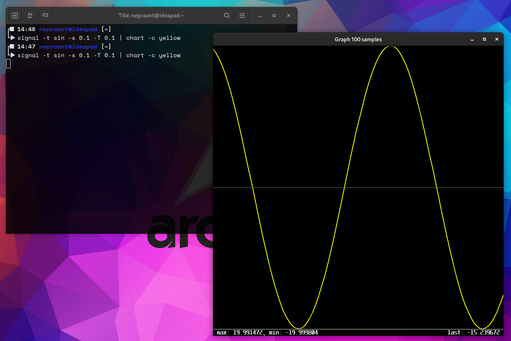

# CHART

Program, that takes input from stdin or file and plots the data in a window.



### options
- ***-h*** print help 
- ***-l [unsigned]*** length of the output signal (number of samples)
- ***-T [double]*** time between samples update in seconds
- ***-c [color name]*** select plot line color
  - red
  - green
  - blue
  - yellow
  - magenta
  - cyan
  - white
  - orange
  - gray
- ***-o [true/false]*** select if input is repeated to the output
- ***-f [filename]*** read input from file instead of stdin

## dependancy
- SDL2
- SDL2_ttf
- SDL2_gfxPrimitives

## compile
```
make 
```

## install
```
sudo make install
```

or

```
doas make install
```

## uninstall
```
sudo make uninstall
```

or

```
doas make uninstall
```

## use 
```
[some signal command] | chart [options]
```

or 

```
chart -f "some signal file" [options]
```


### more than one window can be used
```
[some signal command] | chart -l 100 [options] -o true | chart -l 1000
```
